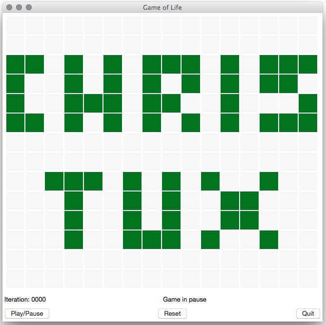
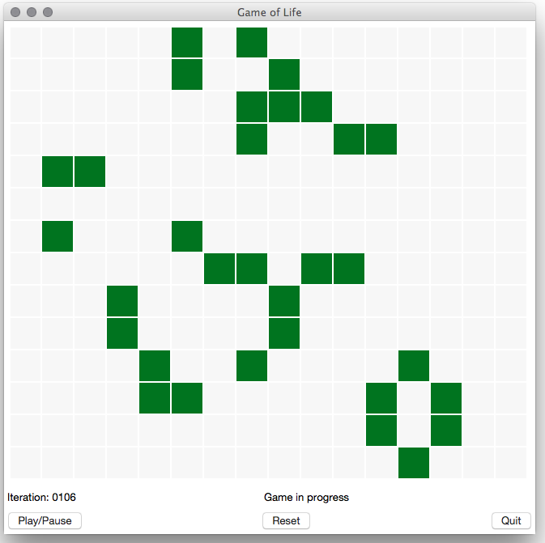
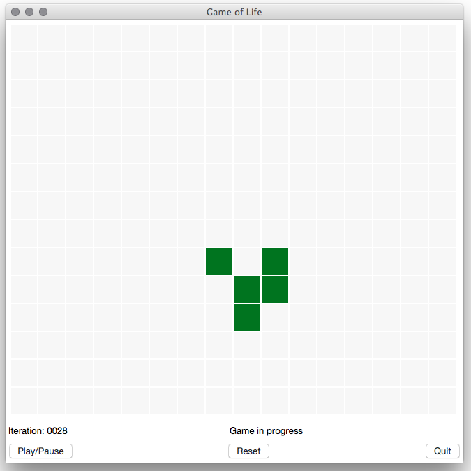
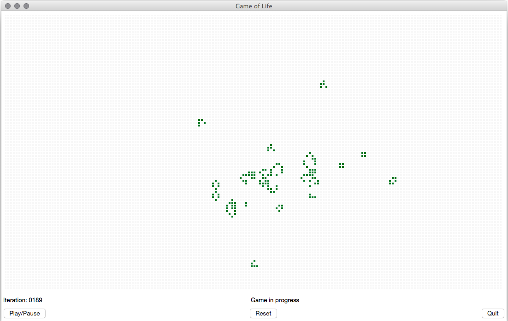

# GameLife
Python graphical Conway's Game of Life

## Summary :

<i>LifeGame.py</i> is the main program. 
<i>Cells.py</i> contains the backend methods for living cells calculation. 
<i>GUI.py</i> is the frontend Tkinter interface. 
 
<i>HPLifeGame.py</i> and <i>HPCells.py</i> are high performances versions for large grids (ables the study of R-pentomino Methuselah. 

## Screenshots :

  
  
  
  

## Links :

See : <a href="https://en.wikipedia.org/wiki/Conway's_Game_of_Life">https://en.wikipedia.org/wiki/Conway's_Game_of_Life</a>. 
See also : <a href="http://www.conwaylife.com/w/index.php?title=R-pentomino">http://www.conwaylife.com/w/index.php?title=R-pentomino</a>.
